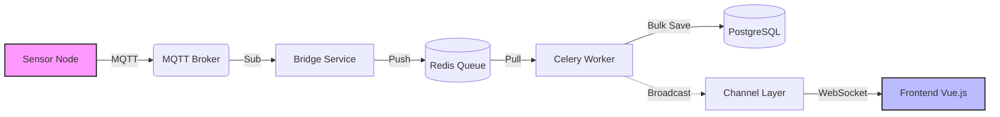

# CottagePilot 🏠

**A full-stack cottage management ecosystem integrating IoT monitoring, automated maintenance, and collaborative scheduling.**

CottagePilot was developed to solve a universal problem for shared property owners: the "nagging" friction of maintenance and the lack of transparency in property upkeep. This platform replaces subjective memory with objective data and automated workflows.


---

## 🚀 Overview

CottagePilot is a proactive property management tool that bridges the gap between physical property health and human coordination.

* **The Problem:** Maintenance tasks were often forgotten, responsibility was unclear, and environmental risks (like pipe bursts or mold) were only discovered after the damage was done.
* **The Solution:** A centralized hub where maintenance is triggered by real-time sensor data or pre-defined annual schedules, with an automated "enforcer" system to handle reminders.
* **The Goal:** A scalable SaaS product capable of handling multi-tenant cottage ownership.

---

## 🛠️ Tech

**##Tech Stach**
| Layer | Technologies |
| :--- | :--- |
| **Frontend** | Vue.js 3, TypeScript, Tailwind CSS |
| **Backend** | Django, Django REST Framework (DRF), PostgreSQL |
| **IoT / Hardware** | ESP32 Microcontrollers, REST API (HTTP POST), C++/Arduino |
| **DevOps** | Docker, Docker Compose, Nginx |
| **SaaS Features** | Stripe Integration, Multi-tenant Authentication |

## Sensor Data Flow

The platform uses a robust, real-time data pipeline to ensure sensor readings are accurate, persistent, and instantly visible to users.

### Data Journey
1.  **Detection**: IoT sensors (e.g., ESP8266) read physical data (Temperature, Humidity).
2.  **Transmission**: Sensors publish encrypted JSON payloads to the **MQTT Broker** (Mosquitto).
3.  **Ingestion**: A Python **Bridge** service subscribes to MQTT and pushes raw data into a **Redis** queue.
4.  **Processing**: **Celery Workers** pick up batched data from Redis, validate it, provision new sensors (if needed), and bulk-save to **PostgreSQL**.
5.  **Real-Time Push**: Upon saving, a background task broadcasts the new data via **Django Channels** (WebSockets) to the specific cottage's group.
6.  **Visualization**: The Vue.js Frontend receives the WebSocket message and instantly updates the live line charts without a page reload.

### Architecture Diagram




---

## ✨ Key Features

### 1. IoT Environmental Monitoring
The system integrates custom **ESP32 sensors** to monitor the property's vitals.
* **Real-time Telemetry:** Sensors report temperature and humidity every 5–15 minutes.
* **Automated Task Triggers:** If sensors detect threshold violations (e.g., freezing temperatures in winter), the backend automatically generates high-priority maintenance tasks.
* **Power Optimization:** Logic varies reporting frequency based on whether the unit is battery-powered or USB-C powered.

### 2. Automated Maintenance Logic
* **Objective Accountability:** Tasks are defined at the start of the season. If a task becomes overdue, the system sends automated email alerts to all owners. Removing the social awkwardness of one person having to "nag" others.
* **Priority Ranking:** Visual indicators for urgent vs. routine maintenance.

### 3. Collaborative Tools
* **Booking Calendar:** A conflict-free scheduling system for cottage visits.
* **The Leaderboard:** A social element featuring "biggest fish" tracking and shared grocery/repair notes to keep the family engaged.

### 4. SaaS Infrastructure
* **Multi-tenancy:** Architected to support multiple separate cottage groups.
* **Payment Gateway:** Integrated **Stripe** for handling subscription-based access.

---

## 📂 Project Structure

```text
COTTAGEPILOT_PUBLIC/
├── backend/                # Django REST Framework Root
│   ├── accounts/           # User authentication and profile management
│   ├── analytics/          # Data processing and usage insights
│   ├── calendarApp/        # Cottage visit scheduling logic
│   ├── cottageInstance/    # Multi-tenant property models
│   ├── notes/              # Shared notes and leaderboard system
│   ├── sensorhub/          # Django root folder
│   ├── sensors/            # Individual sensor configurations
│   ├── stripeApp/          # Subscription and payment integration
│   ├── tasks/              # Automated alerting, task scheduling and maintenance logic
│   ├── celery_app.py       # Asynchronous task queue configuration
│   ├── supervisord.conf    # Process control system configuration
│   └── manage.py           # Django CLI
├── esp_sensors/            # ESP32 firmware (C++ / Arduino / MicroPython)
├── frontend/               # Vue.js 3 + TypeScript source
│   ├── src/                # Component and view logic
│   ├── public/             # Static assets
│   ├── tailwind.config.js  # Styling configuration
│   ├── vite.config.ts      # Build tool configuration
│   └── package.json        # Frontend dependencies
├── nginx/                  # Web server and reverse proxy configuration
├── docker-compose.local.yml # Local orchestration configuration
└── README.md
