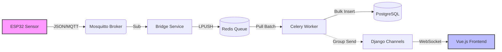

# CottagePilot 🏠


**A full-stack cottage management ecosystem integrating IoT monitoring, automated maintenance, and collaborative scheduling.**

CottagePilot was built to address the friction of shared property ownership: subjective maintenance "nagging", lack of transparency, and the risk of unnoticed environmental damage. By replacing memory with objective data and automated workflows, it transforms property upkeep into a managed, scalable process.

---

## 🚀 Overview

CottagePilot acts as the central nervous system for shared properties, bridging the gap between physical health and human coordination.

*   **The Problem:** Maintenance is often reactive. Pipes burst because heating fails unnoticed; tasks are forgotten; resentment builds over unequal workload distribution.
*   **The Solution:** A SaaS platform where real-time sensor data triggers automated maintenance tickets. "If temp < 5°C, create Urgent Task: 'Check Heating'."
*   **The Engineering Goal:** To build a robust, event-driven architecture capable of handling high-concurrency IoT ingestion while delivering millisecond-latency updates to the frontend.

---

## 🛠️ Tech Ecosystem

| Layer | Technologies | Role |
| :--- | :--- | :--- |
| **Frontend** | **Vue.js 3**, TypeScript, Tailwind CSS, Pinia | Reactive UI, state management, and real-time visualization. |
| **Backend** | **Django**, DRF, **Channels** (WebSockets) | REST API, Auth, and async event broadcasting. |
| **Data Layer** | **PostgreSQL**, **Redis** | Relational persistence and high-speed message buffering. |
| **IoT / Edge** | **ESP32** (C++/Arduino), **MQTT** | Telemetry capture and secure transmission. |
| **DevOps** | Docker, Nginx, Celery | Containerization, reverse proxying, and background worker orchestration. |

---

## 🏗️ System Architecture & Design Decisions

Designing for IoT requires handling asynchronous data flows that don't block the main application thread. Below is the event-driven pipeline implemented to ensure scalability.

### Architectural Decision Records (ADR)
*   **Decoupled Ingestion (MQTT + Bridge):** Instead of the Django app listening directly to sensors, an intermediate **MQTT Broker** and a lightweight **Python Bridge** buffer data into **Redis**. This prevents high-frequency sensor spikes from overwhelming the primary database.
*   **Hybrid Communication:** We use **REST** for standard CRUD (User management, Bookings) but **WebSockets (Django Channels)** for live sensor dashboards. This reduces server load by eliminating frontend polling.
*   **Asynchronous Persistence:** **Celery Workers** consume the Redis buffer in batches (`bulk_create`), optimizing database transactions.

### Data Flow Diagram



---

## 🧩 Key Engineering Challenges

### 1. Closing the Loop: Headless Sensor Provisioning
**Challenge:** How do you securely register a "headless" IoT device that has no UI/Keyboard?
**Solution:** Implemented a bi-directional provisioning flow.
1.  Unregistered sensors publish to `sensors/data` with a default code.
2.  The backend detects the new ID, generates a cryptographically secure `code`, and creates a pending record.
3.  The backend publishes the new code back to `sensors/provision/{sensor_id}` via MQTT.
4.  The sensor listens for this specific topic, writes the code to EEPROM, and uses it for all future authenticated transmissions.

### 2. Bridging Async Workers with Real-Time Sockets
**Challenge:** `Celery` workers (running in a separate process) save data to the DB, but the `WebSocket Consumer` (Daphne) needs to know about it instantly to update the UI.
**Solution:** Leveraged the `channel_layer` (Redis-backed) within the Celery task. Immediately after a DB commit, the worker broadcasts a standardized JSON payload to the specific `sensors_group_{cottage_id}`, enabling a seamless "Database -> UI" sync without HTTP overhead.

### 3. Multi-Tenant Data Isolation
**Challenge:** Ensuring Sensor A's data is only visible to Cottage B's owners.
**Solution:** Implemented strict Group-Based Access Control (GBAC). WebSocket connections are authenticated via Token and assigned to specific Channel Groups based on the user's `CottageInstance` association. Data is routed strictly to these groups, preventing cross-tenant data leakage.

---

## ✨ Key Features

### 1. IoT Environmental Monitoring
*   **Real-time Telemetry:** Live charts for Temperature, Humidity, and Pressure.
*   **Automated Triggers:** "Smart Tasks" are generated automatically when environmental thresholds are breached.

### 2. Automated Maintenance Logic
*   **Objective Accountability:** Usage-based or time-based maintenance schedules.
*   **Escalation:** System auto-emails owners when high-priority tasks are overdue.

### 3. Collaborative Tools
*   **Conflict-Free Booking:** Visual calendar for managing shared custody.
*   **Notes:** Track contributions, missing tools and note-taking.

---

## 📂 Project Structure

```text
COTTAGEPILOT_ROOT/
├── backend/                # Django REST Framework Monorepo
│   ├── sensorhub/          # Project settings & routing
│   ├── sensors/            # Sensor logic & WebSocket consumers
│   ├── tasks/              # Celery tasks & Automation rules
│   ├── mqtt_to_redis.py    # Ingestion Bridge Service
│   └── ...
├── esp_sensors/            # Embedded C++ Firmware
├── frontend/               # Vue.js 3 SPA
│   ├── src/stores/         # Pinia Stores (State)
│   ├── src/views/          # Views (Dashboard, Analytics)
│   └── ...
├── nginx/                  # Production Reverse Proxy
└── docker-compose.yml      # Container Orchestration
```

---

## 🚀 Getting Started

### Prerequisites
*   Docker & Docker Compose
*   Node.js 18+ (for local frontend dev)

### Quick Launch (Docker)
1.  **Clone & Configure:**
    ```bash
    git clone https://github.com/sonofpeter-git/CottagePilot.git
    cp backend/.local.env.example backend/.local.env
    ```
2.  **Ignition:**
    ```bash
    docker compose -f docker-compose.local.yml up --build
    ```

3.   **Configuration:**
   *    In backend container run:
   ```bash
    python manage.py migrate
    ```
---
    **Configuration:**
    ```bash
    python manage.py createsuperuser
    ```
---
    *    Then navigate to http://localhost:8000/backend/admin and signin
    *    Go to Cottage instance models and create a cottage instance and add your admin user as a CottageUser (put "-" in stripe fields, but check the "Stripe payment status box"
    *
    *    Now you are ready to signin:
    *    Navigate to http://localhost:8080 and signin
    *    If you prefer to add simulated sensors it can be done through the admin panel at http://localhost:8000/backend/admin
4.  **Access:**
    *   Frontend: `http://localhost:8080`
    *   API / Admin: `http://localhost:8000`

---

## ⚖️ License

Distributed under the MIT License. See `LICENSE` for more information.
